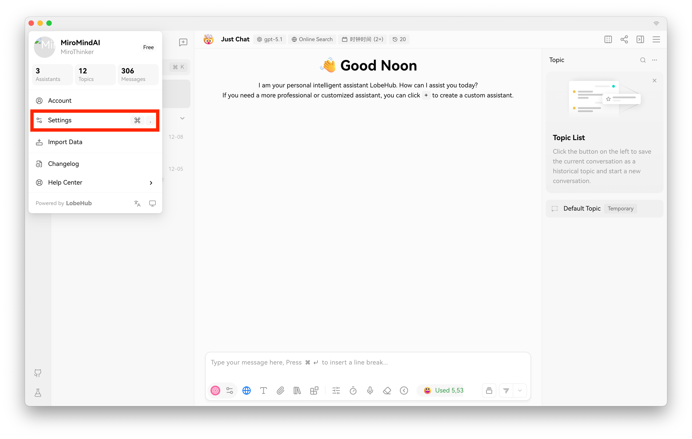
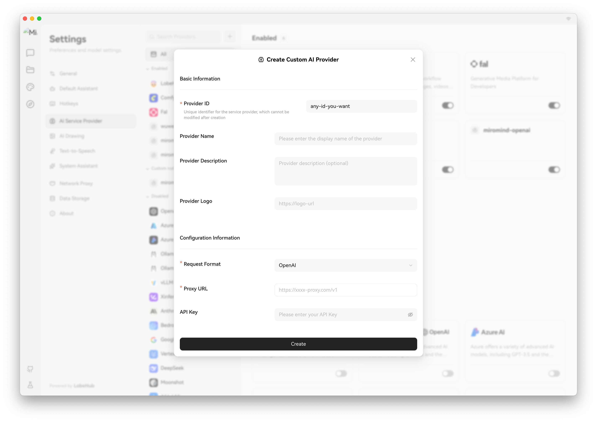
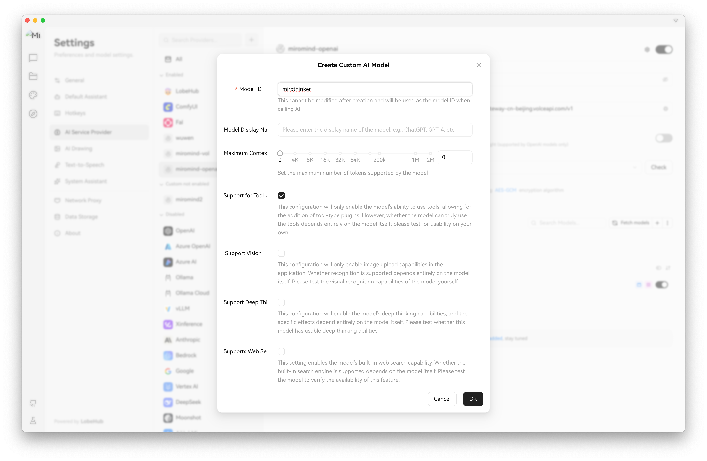
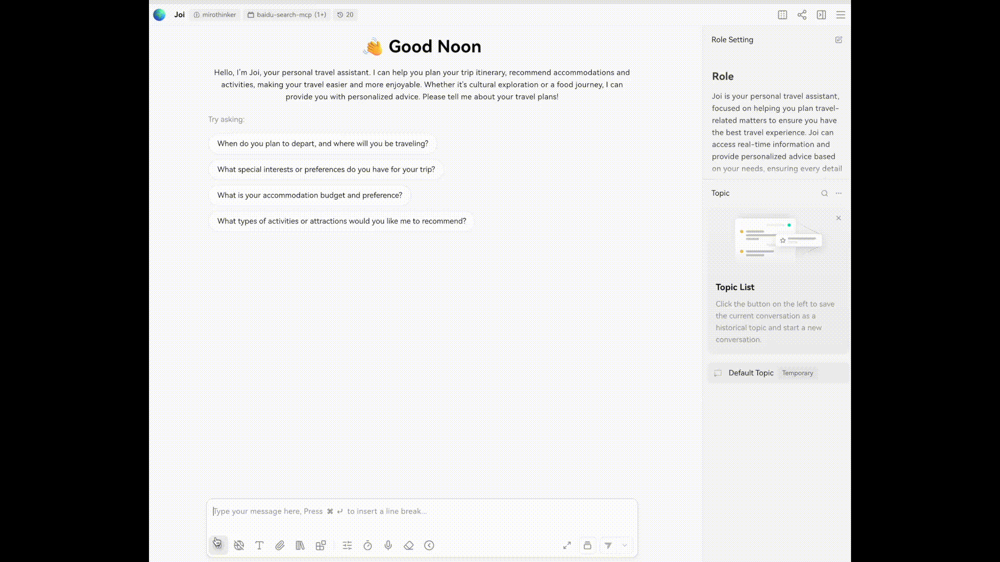

# LobeChat Integration Guide

This guide describes how to integrate the MiroThinker model with [LobeChat](https://github.com/lobehub/lobe-chat), an open-source, modern LLM UI framework supporting tool usage (function calling).

## 1. Start the Inference Service

First, launch the MiroThinker model using vLLM with the OpenAI-compatible API adapter. Ensure you include the tool parser plugin.

```bash
# Configuration
PORT=61002
MODEL_PATH=miromind-ai/MiroThinker-v1.0-30B

# Start vLLM server
vllm serve $MODEL_PATH \
    --served-model-name mirothinker \
    --port $PORT \
    --trust-remote-code \
    --chat-template chat_template.jinja \
    --tool-parser-plugin MirothinkerToolParser.py \
    --tool-call-parser mirothinker \
    --enable-auto-tool-choice
```

## 2. Configure LobeChat

You can use either the self-hosted version or the [web application](https://lobechat.com/chat).

### Step 1: Access Settings

Navigate to **Settings** -> **Language Model** to add a custom AI service provider.



### Step 2: Add Custom AI Provider

Click the `+` button to add a new provider and configure it as follows:



| Field | Value | Description |
| :--- | :--- | :--- |
| **Provider ID** | `miromind` | Or any identifier you prefer. |
| **Request Format** | `OPENAI` |  |
| **API Key** | `your-api-key` | Use any string if auth is disabled. |
| **API Proxy Address** | `http://localhost:61002/v1` | Replace with your actual service address. |

### Step 3: Configure the Model

After adding the provider, go to the model list section for that provider:

1. Add a new model with the ID `mirothinker` (must match `--served-model-name`).
2. **Crucial**: Enable the **Function Calling** capability toggle.
3. Click "Check" to verify connectivity.



## 3. Usage Demo

Once configured, you can use MiroThinker in LobeChat with full tool-calling capabilities.



## Requirements

- vLLM >= 0.11.0
